# SATARK — Disaster-Response Digital Twin System

[](https://www.python.org/)
[](https://www.djangoproject.com/)
[](https://reactjs.org/)
[](https://threejs.org/)
[-brightgreen.svg)]()
[]()

> **SATARK** (*Sensing, Analytics, Topographic Assessment & Real-time Knowledge*) is a high-performance, zone-based **Disaster-Response Digital Twin** engineered for municipal disaster command centers, urban flood simulation, critical infrastructure cascading analysis, and automated decision-support optimization.

---

## Table of Contents
- [1. Executive Summary & Problem Alignment](#1-executive-summary--problem-alignment)
- [2. System Architecture](#2-system-architecture)
  - [2.1 Subsystem Separation & Core Philosophy](#21-subsystem-separation--core-philosophy)
  - [2.2 Simulation Engine Stepping Pipeline](#22-simulation-engine-stepping-pipeline)
  - [2.3 Physical, Hydraulic & Machine Learning Models](#23-physical-hydraulic--machine-learning-models)
- [3. Key Subsystems & Features](#3-key-subsystems--features)
  - [3.1 Graph-Based Drainage Network & Manning Hydraulics](#31-graph-based-drainage-network--manning-hydraulics)
  - [3.2 Temporal Hyetographs & 0–3h Nowcasting](#32-temporal-hyetographs--03h-nowcasting)
  - [3.3 Explainable Critical Infrastructure Cascade DAG](#33-explainable-critical-infrastructure-cascade-dag)
  - [3.4 Agent Evacuation, Crowd Panic & Shelter Dynamics](#34-agent-evacuation-crowd-panic--shelter-dynamics)
  - [3.5 Multi-Objective Counterfactual Intervention Optimizer](#35-multi-objective-counterfactual-intervention-optimizer)
  - [3.6 Dual Command Interface: 3D Hologram + 2D GIS Map](#36-dual-command-interface-3d-hologram--2d-gis-map)
- [4. Performance & Benchmarking](#4-performance--benchmarking)
- [5. Technology Stack](#5-technology-stack)
- [6. Getting Started / Quickstart Guide](#6-getting-started--quickstart-guide)
  - [6.1 Prerequisites](#61-prerequisites)
  - [6.2 Backend Setup](#62-backend-setup)
  - [6.3 Frontend Setup](#63-frontend-setup)
  - [6.4 Running the Test Suite](#64-running-the-test-suite)
- [7. Operational Walkthrough (Standard Operating Procedure)](#7-operational-walkthrough-standard-operating-procedure)
- [8. Documentation & Guides](#8-documentation--guides)
- [9. License](#9-license)

---

## 1. Executive Summary & Problem Alignment

Rapid urbanization, climate variability, and extreme precipitation events (such as the 2005 Mumbai 944 mm cloudburst) pose catastrophic threats to coastal and metropolitan cities. Municipal disaster managers often face fragmented, delayed data: rainfall figures exist in isolation from storm drain pipe capacities; infrastructure dependencies (such as substation flooding triggering water treatment shutdown) fail silently in cascading sequences; and evacuation shelters overflow while nearby safe zones sit empty.

**SATARK** solves this challenge by providing a unified, authoritative **digital twin** that:
1. **Couples Surface Hydrology with 1D Subsurface Drainage Hydraulics**: Tracks physical water volumes, pipe capacity utilization, and hydraulic surcharge ponding back onto city streets.
2. **Predicts Cascading Infrastructure Collapse**: Simulates failure propagation across power substations, water pumping stations, healthcare facilities, and telecom networks via a Directed Acyclic Graph (DAG).
3. **Models Realistic Human Response**: Simulates zone-level panic escalation, shelter capacity intake, and Dijkstra-based crowd evacuation across 21 metropolitan wards.
4. **Quantifies Counterfactual Intervention Impacts**: Evaluates candidate interventions (mobile drainage pumps, backup generator dispatch, evacuation rerouting) against baseline disaster projections to recommend the mathematically optimal response.
5. **Operates Entirely Standalone & Offline**: Built on realistic synthetic models of Mumbai coastal wards, eliminating dependencies on external proprietary data feeds while delivering sub-15ms simulation execution.

---

## 2. System Architecture

### 2.1 Subsystem Separation & Core Philosophy

SATARK adheres to strict architectural boundaries:
- **Backend (`backend/`)**: Authoritative owner of physical laws, hydraulic simulations, ML inference, cascade propagation, agent movement, risk calculation, and optimization algorithms.
- **Frontend (`frontend/`)**: High-fidelity visualization and command-and-control interface (3D Three.js WebGL + 2D Leaflet GIS). The frontend *never* invents or recalculates physical state; it faithfully visualizes the backend digital twin.

```mermaid
graph TB
    subgraph Frontend["Frontend Command Center (React 18 + Three.js + Leaflet)"]
        UI_3D[3D Holographic City<br/>GTAO Shaders / 250 Animated Agents]
        UI_GIS[2D GIS Map View<br/>CartoDB Dark Matter / Wards & Contours]
        UI_CTRL[Command HUD & Controls<br/>Nowcast Scrubber / Presets / Interventions]
        STORE[Zustand Store<br/>useStore / Normalized State Sync]
    end

    subgraph REST_API["Django REST Framework API Layer"]
        API_SIM[/api/simulation/*<br/>start, step, pause, reset, nowcast, presets]
        API_WORLD[/api/world/*<br/>zones, safe-zones]
        API_NAV[/api/navigation/route/]
        API_DEC[/api/decision/*<br/>interventions, evaluate, apply]
    end

    subgraph BackendEngine["Backend Authoritative Digital Twin"]
        ENGINE[SimulationEngine]
        STATE[WorldState<br/>Entities, 21 Zones, Ring-Buffer Events]
        PIPELINE[9-Step Simulation Pipeline]
        DRAINAGE[DrainageNetwork & Manning Hydraulics]
        CASCADE[Infrastructure Cascade DAG]
        EVAC[EvacuationEngine & CrowdDynamics]
        ML[FloodImpactPredictor<br/>Pre-Warmed Random Forest]
        OPTIMIZER[OptimizationEngine<br/>Counterfactual Evaluation]
    end

    UI_CTRL --> STORE
    STORE <--> REST_API
    UI_3D <--> STORE
    UI_GIS <--> STORE

    REST_API <--> ENGINE
    ENGINE --> PIPELINE
    PIPELINE --> DRAINAGE
    PIPELINE --> CASCADE
    PIPELINE --> EVAC
    PIPELINE --> ML
    ENGINE --> OPTIMIZER
    PIPELINE --> STATE
```

---

### 2.2 Simulation Engine Stepping Pipeline

Each simulation tick (representing 1 operational hour, $\Delta t = 3600\text{ s}$) progresses through a deterministic, strictly ordered 9-step pipeline:

```mermaid
flowchart LR
    S1[1. RainfallStep<br/>Temporal Hyetograph] --> S2[2. DrainageStep<br/>Manning Hydraulics]
    S2 --> S3[3. SurfaceFloodStep<br/>Volume & Surcharge]
    S3 --> S4[4. FloodImpactStep<br/>Vectorized ML Model]
    S4 --> S5[5. InfrastructureCascadeStep<br/>Explainable DAG]
    S5 --> S6[6. HumanEvacuationStep<br/>Dijkstra & Shelters]
    S6 --> S7[7. RiskAssessmentStep<br/>4-Factor Weighted]
    S7 --> S8[8. DecisionInterventionStep<br/>Rules & Active Boosts]
    S8 --> S9[9. MetricsStep<br/>Casualties & State Summary]
```



1. **`RainfallStep`**: Calculates instantaneous rainfall intensity based on the active hyetograph (Huff Quartile, Mumbai 2005 cloudburst, or uniform).
2. **`DrainageStep`**: Computes subsurface stormwater pipe inflow and conveyance using Manning's open-channel equation. Identifies surcharging pipes where hydraulic capacity is exceeded.
3. **`SurfaceFloodStep`**: Updates zone water volumes based on rainfall inflow, drainage removal, and surcharge return, maintaining mass conservation.
4. **`FloodImpactStep`**: Evaluates infrastructure damage potential and flood severity via pre-warmed ML inference.
5. **`InfrastructureCascadeStep`**: Propagates functional disruption across the dependency DAG (Power $\rightarrow$ Water $\rightarrow$ Hospital $\rightarrow$ Telecom).
6. **`HumanEvacuationStep`**: Updates panic levels, routes agents along safe paths, and records shelter intake.
7. **`RiskAssessmentStep`**: Calculates composite risk scores per zone across water depth, infrastructure impact, human vulnerability, and drainage stress.
8. **`DecisionInterventionStep`**: Applies active emergency interventions (e.g. mobile pump boosts) and generates rule-based tactical recommendations.
9. **`MetricsStep`**: Aggregates population status (safe, evacuating, injured, casualties), overall risk indices, and records capped events.

---

### 2.3 Physical, Hydraulic & Machine Learning Models

#### 1. Manning's Equation for Subsurface Stormwater Conveyance
Pipe conveyance capacity $Q_{\text{cap}}$ ($\text{m}^3/\text{s}$) is computed using Manning's formula for gravity-flow circular conduits:
$$Q_{\text{cap}} = \frac{1}{n} A R_h^{2/3} S^{1/2}$$
Where:
- $n$: Manning's roughness coefficient ($n = 0.013$ for reinforced concrete pipe)
- $A$: Cross-sectional flow area ($A = \frac{\pi D^2}{4}$)
- $R_h$: Hydraulic radius ($R_h = \frac{D}{4}$ for full-flowing circular pipe)
- $S$: Conduit hydraulic slope ($S = \frac{\Delta h}{L}$)

When surface runoff into the catch basin exceeds $Q_{\text{cap}}$, excess water surcharges back to the ground surface:
$$Q_{\text{surcharge}} = \max\left(0, Q_{\text{inflow}} - Q_{\text{cap}}\right)$$

#### 2. Huff Quartile Temporal Precipitation Distribution
To avoid artificial flat rainfall curves, rainfall temporal distribution is modeled via Huff 4-parameter cumulative curves:
$$P(t) = P_{\text{total}} \cdot \left( a \tau^3 + b \tau^2 + c \tau + d \right), \quad \tau = \frac{t}{T}$$

#### 3. Vectorized Machine Learning Flood Predictor
SATARK employs a pre-trained **Random Forest Regressor** trained on topographic slope, surface runoff, soil permeability, and drainage density. Model inference is fully vectorized across all 21 zones simultaneously ($\sim 0.2\text{ ms}$ inference time) with cache pre-warming on application boot.

---

## 3. Key Subsystems & Features

### 3.1 Graph-Based Drainage Network & Manning Hydraulics
- Topologically modeled with nodes (catch basins, junctions, pump stations, outfalls) and directed conduit edges.
- Dynamic pipe utilization ($0.0$ to $>1.0$ surcharge).
- Real-time detection of drainage bottlenecks and urban ponding.

### 3.2 Temporal Hyetographs & 0–3h Nowcasting
- Supports 4 precipitation patterns: **Mumbai 2005 Cloudburst (944 mm)**, **Huff Quartile 2 Peak**, **Standard Monsoon**, and **Uniform Intensity**.
- Dedicated `NowcastEngine` forks simulation state in memory and projects forward $t+1\text{h}$, $t+2\text{h}$, and $t+3\text{h}$ inundation depths without mutating the live baseline run.
- Interactive time-horizon scrubber in the command dashboard.

### 3.3 Explainable Critical Infrastructure Cascade DAG
- Directed Acyclic Graph modeling dependencies between 15 critical infrastructure assets across Mumbai wards:
  - Electric Substations (`E01`, `E02`, `E03`)
  - Water Treatment Plants (`W01`, `W02`)
  - District Hospitals (`H01`, `H02`, `H03`)
  - Emergency Services & Telecom Towers
- Cascade path tracing: visually and programmatically identifies root-cause failures (e.g. *Substation E01 flooded $\rightarrow$ Water Plant W01 loses power $\rightarrow$ Hospital H02 backup generator required*).

### 3.4 Agent Evacuation, Crowd Panic & Shelter Dynamics
- 250 representative visual 3D agents dynamically populated across the 21 zones according to synthetic ward population density.
- Panic escalation based on flood rise rate and proximity to flooded streets.
- Dijkstra pathfinding to authoritative backend safe zones and municipal evacuation shelters.
- Shelter capacity tracking preventing dangerous overcrowding.

### 3.5 Multi-Objective Counterfactual Intervention Optimizer
- Automatically evaluates tactical interventions:
  - `deploy_mobile_pumps`: Boosts local zone drainage conveyance.
  - `dispatch_backup_power`: Prevents secondary hospital and pump cascade trips.
  - `reroute_evacuation_corridor`: Redirects evacuees away from surcharged streets.
- Generates side-by-side **Baseline vs. Intervention diffs** (casualties avoided, flood volume diverted, infrastructure saved) with human-readable operational rationales.

### 3.6 Dual Command Interface: 3D Hologram + 2D GIS Map
- **3D Holographic Command Center**: Three.js WebGL renderer with GTAO ambient occlusion, custom toon-shading shaders, Voronoi zone boundary projection, and animated capsule agents.
- **2D CartoDB Dark Matter GIS View**: Built on Leaflet with georeferenced Mumbai coastal wards (`Z01` Colaba through `Z21` Borivali), interactive flood contour circles, surcharge indicators, and detailed municipal ward popups.
- **Instant Mode Toggle**: Effortless switching between 3D spatial twin and 2D GIS overview from the top navigation bar.

---

## 4. Performance & Benchmarking

Benchmarked via automated regression test suite (`backend/tests/test_benchmarks.py`) on standard development hardware:

| Benchmark | SIH / System Target | Measured Achievement | Result |
| :--- | :--- | :--- | :--- |
| **1-Hour Simulation Tick ($\Delta t = 3600\text{s}$)** | $< 100\text{ ms}$ | **12.21 ms** | **8.2x faster than requirement** |
| **Warm Scenario Initialization** | $< 50\text{ ms}$ | **12.25 ms** | **4x faster than requirement** |
| **Intervention Counterfactual Optimization** | $< 1000\text{ ms}$ | **587.11 ms** | **Comfortably under target** |
| **Render Loop Vector Allocations** | $< 1000\text{ allocs/s}$ | **0 allocations/s** | **GC pauses eliminated** |
| **Three.js Uniform Update Complexity** | $O(N)$ scene traversal | **$O(1)$ set iteration** | **Rock-solid 60 FPS** |
| **Long-Running Memory Stability (50 ticks)** | Stable, bounded | **Capped at 50 events** | **Zero memory leaks** |
| **Backend Test Suite Pass Rate** | $100\%$ | **93 / 93 tests (100%)** | **Clean pass in 7.2s** |

---

## 5. Technology Stack

### Backend
- **Core Framework**: Python 3.11+, Django 5.0+, Django REST Framework
- **Computational Core**: NumPy, SciPy (Manning hydraulics, Huff curves, Dijkstra routing)
- **Machine Learning**: Scikit-Learn (Vectorized Random Forest Regressor)
- **Testing**: Pytest, Pytest-Django

### Frontend
- **Framework**: React 18, TypeScript 5.2+, Vite 5.3+
- **3D Graphics**: Three.js (r164), Ground Truth Ambient Occlusion (GTAO), custom GLSL shaders
- **2D GIS Mapping**: Leaflet 1.9+, CartoDB Dark Matter tile service
- **State Management**: Zustand 4.5+ (Normalized single-source-of-truth store)
- **Styling**: Vanilla Modern CSS Design System (Glassmorphic dark aesthetic)

---

## 6. Getting Started / Quickstart Guide

### 6.1 Prerequisites
- **Python**: Version 3.11 or higher
- **Node.js**: Version 18.x or 20.x LTS
- **Git**

---

### 6.2 Backend Setup

```bash
# 1. Clone the repository
git clone https://github.com/Rohan-118/SATARK.git
cd SATARK

# 2. Create and activate Python virtual environment
python -m venv .venv

# On Windows (PowerShell):
.venv\Scripts\Activate.ps1
# On Linux / macOS:
source .venv/bin/activate

# 3. Install backend dependencies
pip install -r requirements.txt

# 4. Apply database migrations
python backend/manage.py migrate

# 5. Start the backend development server
python backend/manage.py runserver 8000
```
Backend API will be running at `http://localhost:8000/api/`.

---

### 6.3 Frontend Setup

Open a separate terminal window:

```bash
cd SATARK/frontend

# 1. Install frontend dependencies
npm install

# 2. Start the Vite development server
npm run dev
```
Open `http://localhost:5173/` in any modern WebGL-compatible browser (Chrome, Edge, Firefox, Brave).

---

### 6.4 Running the Test Suite

```bash
# Run all 93 backend unit, integration, and benchmark tests
pytest backend/tests/ -v

# Run performance benchmarks specifically
pytest backend/tests/test_benchmarks.py -v -s

# Run frontend TypeScript type checking
npm --prefix frontend run lint

# Build frontend production bundle
npm --prefix frontend run build
```

---

## 7. Operational Walkthrough (Standard Operating Procedure)

1. **Baseline Inception**: Open `http://localhost:5173/`. Observe the normal baseline state: all 21 Mumbai municipal wards are dry, road network is clear, and 250 representative citizens wander at normal speeds.
2. **Scenario Selection**: In the left configuration panel, choose a disaster preset:
   - *Standard Monsoon Rain*: Moderate rainfall (35 mm/h).
   - *Severe Flash Flood*: Heavy localized downpour (75 mm/h).
   - *Mumbai 2005 Benchmark Cloudburst*: Extreme extreme precipitation (944 mm 24h event).
3. **Initiate Disaster**: Click **"Start Simulation"**.
4. **Observe Dynamic Propagation**:
   - Stormwater pipes begin filling; surcharging occurs in low-elevation wards (`Z04` Dadar, `Z08` Kurla).
   - 3D visual agents transition from normal wander to panic flight mode.
   - The infrastructure cascade triggers: Substation `E01` trips due to water height, causing secondary outage at Water Treatment Plant `W01`.
5. **Inspect 0–3h Nowcasting**: Drag the Forecast Horizon slider in the bottom HUD to $t+1\text{h}, t+2\text{h}, t+3\text{h}$ to preview projected inundation depths before they occur.
6. **Toggle 2D GIS View**: Click **"2D GIS"** in the top navigation bar to inspect georeferenced municipal ward boundaries, flood contours, and drainage surcharge indicators across Mumbai coastal geography.
7. **Evaluate Decision Recommendations**: In the right panel, review AI-generated tactical recommendations. Click **"Evaluate Interventions"** to run a counterfactual comparison showing exact expected reductions in casualties, flood height, and infrastructure downtime.
8. **Apply Intervention**: Approve the recommendation (e.g. *Deploy Mobile Drainage Pumps to Z04*). Watch the flood volume curve flatten and agents successfully reach designated safe zones.

---

## 8. Documentation & Guides

- [Smart India Hackathon (SIH) Pitch & Judge Walkthrough Guide](docs/SIH_PITCH_AND_DEMO_GUIDE.md): Complete presentation script, 5-minute judge demo playbook, and problem statement compliance matrix.
- [REST API Reference & OpenAPI Schema](docs/API_REFERENCE.md): Comprehensive endpoint documentation with request/response schemas and curl examples.
- [Optimization & Phase History](optimisations.md): Complete engineering log of Phases 0 through 10 refactorings, test repairs, and performance benchmarks.

---

## 9. License

This project is developed for the Smart India Hackathon (SIH). Distributed under the MIT License. See `LICENSE` for more information.
