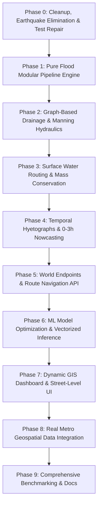

# SATARK — Complete Project Optimisation, Architectural & Implementation Plan
## Urban Flood Nowcasting System (Drainage and Rainfall Coupling)

> **Date**: 2026-09-13  
> **Auditor**: SATARK Digital-Twin Engineering Team  
> **Scope**: Full audit of every directory, file, class, and line of code across `backend/`, `frontend/`, and root for dead weight, structural defects, low-level programming bugs, performance bottlenecks, and competition readiness.  
> **Strategic Mandate**: 100% focus on **Urban Flood Nowcasting System (Drainage and Rainfall Coupling)**. The Earthquake calamity is completely removed from backend and frontend. Monolithic files (`engine.py`, `CityRenderer.ts`, `RightPanel.tsx`, `ZoneConfiguration.tsx`) are decomposed into clean, modular subfolders for maximum performance and maintainability.

---

## Executive Audit & Architectural Context

A forensic audit of the SATARK codebase reveals the true current state of the architecture:

1. **Strategic Pivot (Drop Earthquake)**: SATARK was originally scaffolded as a dual-calamity digital twin (Flood & Earthquake). However, the competition problem statement strictly mandates an **Urban Flood Nowcasting System (Drainage and Rainfall Coupling)**. In the codebase, Earthquake was only partially scaffolded: its simulation tick was literally a `pass` statement (`engine.py:2176`), its frontend renderer had no 3D visuals (`EarthquakeRenderer.ts`), and it merely shook the canvas via CSS. **Earthquake is now completely deprecated and scheduled for immediate removal across all layers.**
2. **The 69 Empty Frontend Stubs vs. Monolithic Reality**:
   - Early in development, fine-grained micro-components and multi-page routes (`pages/Dashboard.tsx`, `Analytics.tsx`, `components/dashboard/*`, `components/simulation/*`, `city/agents/*`) were scaffolded as 0-byte or 2-byte placeholders.
   - Under hackathon pressure, development pivoted to **monolithic production files**: all Three.js logic was concentrated in `src/city/CityRenderer.ts` (1,387 lines, 52.9 KB), UI controls were packed into `src/components/workflow/` (`LeftPanel.tsx`, `RightPanel.tsx`, `ZoneConfiguration.tsx`), and the backend engine into `backend/simulation/engine.py` (4,443 lines, 70 methods).
   - AST import scans confirm that **0 imports** reference any of the 69 frontend stub files. They are 100% redundant duplicates and will be deleted.
3. **Subfolder Decomposition for High Efficiency**:
   - Rather than keeping 4,443 lines in `engine.py` or 320+ lines in `RightPanel.tsx`, we must now **divide these monoliths into clean, purpose-built subfolders**:
     - `backend/simulation/pipeline/` for the 8 discrete simulation step handlers.
     - `backend/algorithms/drainage/` for the stormwater graph, Manning hydraulics, and surcharge coupling.
     - `backend/algorithms/rainfall/` for hyetographs, radar ingestion, and 0–3h nowcasts.
     - `backend/algorithms/navigation/` for the flood-safe route finding REST API.
     - `frontend/src/components/impact/` and `components/recommendations/` to break up `RightPanel.tsx`.
     - `frontend/src/components/simulation/` to break up `ZoneConfiguration.tsx`.
     - `frontend/src/components/gis/` for the new 2D Leaflet GIS street map layer.
4. **Failing Test Suite**: Running `pytest` on the backend fails across 14 tests due to stale `Scenario` constructor parameters, missing `pytest.ini` / Django test environment configuration, and loose ad-hoc test scripts in `backend/` that crash trying to connect to a live HTTP server.
5. **Physical Mass-Conservation Defect**: In `backend/algorithms/flood/propagation.py`, water is created and destroyed out of thin air because zone elevation comparisons use asynchronous, un-stepped neighbor states and outflow is uncapped.

---

## PART 1 — COMPLETE INVENTORY & MAPPING OF EMPTY FILES & DEAD CODE

### 1.1 Forensic Mapping: Frontend 69 Stub Files vs. Active Implementations

Every single one of the 69 empty / 2-byte stub files in `frontend/src/` has been verified via import tracing. Below is the authoritative mapping proving that **none of these files are necessary** because active, consolidated modules are already performing 100% of their intended functions:

| Stub File Path (Size) | Intended Role | Active File Performing Its Job | Technical Proof & Architectural Reason |
|---|---|---|---|
| `api/calamity.ts` (2 B) | Calamity API endpoints | [simulationApi.ts](file:///c:/Users/sitak/SATARK/frontend/src/api/simulationApi.ts) (3.0 KB) | Calamity initialization and stepping are handled in `simulationApi.ts`. Calamity types are in [domain.ts](file:///c:/Users/sitak/SATARK/frontend/src/types/domain.ts). |
| `api/impact.ts` (2 B) | Impact API calls | [simulationApi.ts](file:///c:/Users/sitak/SATARK/frontend/src/api/simulationApi.ts) | Impact state is fetched as part of `fetchSimulationState()` in `simulationApi.ts`. |
| `api/recommendations.ts` (2 B) | Recommendations API | [simulationApi.ts](file:///c:/Users/sitak/SATARK/frontend/src/api/simulationApi.ts) | `getRecommendations()`, `getRisk()`, `runOptimization()` are all in `simulationApi.ts`. |
| `api/simulation.ts` (2 B) | Simulation lifecycle API | [simulationApi.ts](file:///c:/Users/sitak/SATARK/frontend/src/api/simulationApi.ts) | Identical duplicate path; active implementation was named `simulationApi.ts`. |
| `api/twin.ts` (2 B) | World twin state API | [worldApi.ts](file:///c:/Users/sitak/SATARK/frontend/src/api/worldApi.ts) (2.5 KB) | Zone loading, bounds, and shelter ingestion are implemented in `worldApi.ts`. |
| `city/CityAssets.ts` (0 B) | GLTF / asset loader | [CityRenderer.ts](file:///c:/Users/sitak/SATARK/frontend/src/city/CityRenderer.ts) (52.9 KB) | `GLTFLoader` loads `city.glb` directly inside `CityRenderer.ts` lines 400–480. |
| `city/CityScene.ts` (0 B) | Three.js scene manager | [CityRenderer.ts](file:///c:/Users/sitak/SATARK/frontend/src/city/CityRenderer.ts) & [CityScene.tsx](file:///c:/Users/sitak/SATARK/frontend/src/components/twin/CityScene.tsx) | Three.js scene, camera, lights, and render loop are orchestrated directly in `CityRenderer.ts`; React wrapper is `CityScene.tsx`. |
| `city/agents/Agent.ts` (0 B) | Single agent entity | [AgentRenderer.ts](file:///c:/Users/sitak/SATARK/frontend/src/city/agents/AgentRenderer.ts) (23.2 KB) | Agents are rendered as mass instanced cohorts via `AgentRenderer.ts`. Single-agent Three.js objects were abandoned for performance. |
| `city/agents/AgentAnimations.ts` (0 B) | Agent animation loops | [AgentRenderer.ts](file:///c:/Users/sitak/SATARK/frontend/src/city/agents/AgentRenderer.ts) | Smooth coordinate lerping and state transitions are handled in `AgentRenderer.update()`. |
| `city/agents/AgentManager.ts` (0 B) | Agent collection manager | [agentSlice.ts](file:///c:/Users/sitak/SATARK/frontend/src/store/agentSlice.ts) (2.4 KB) & [AgentRenderer.ts](file:///c:/Users/sitak/SATARK/frontend/src/city/agents/AgentRenderer.ts) | State management lives in Zustand `agentSlice.ts`; 3D rendering lives in `AgentRenderer.ts`. |
| `city/calamities/CalamityLayer.ts` (0 B) | Abstract disaster layer | [DisasterRenderer.ts](file:///c:/Users/sitak/SATARK/frontend/src/city/calamities/DisasterRenderer.ts) (1.2 KB) | Active disaster orchestration is in `DisasterRenderer.ts`. |
| `city/calamities/Earthquake.ts` (0 B) | Earthquake 3D visual layer | *DEPRECATED* | Dropping earthquake completely. (Existing stub class [EarthquakeRenderer.ts](file:///c:/Users/sitak/SATARK/frontend/src/city/calamities/earthquake/EarthquakeRenderer.ts) had no visuals anyway). |
| `city/calamities/Flood.ts` (0 B) | Flood visual mesh | [FloodRenderer.ts](file:///c:/Users/sitak/SATARK/frontend/src/city/calamities/flood/FloodRenderer.ts) (4.4 KB) | Dynamic water plane, foam, and water rising animations are fully implemented in `FloodRenderer.ts`. |
| `city/effects/DamageOverlay.ts` (0 B) | Damage shader effect | [ZoneRenderer.ts](file:///c:/Users/sitak/SATARK/frontend/src/city/zones/ZoneRenderer.ts) (13.7 KB) | Damage and risk colors are rendered directly onto Voronoi zone polygons by `ZoneRenderer.ts`. |
| `city/effects/EvacuationRoutes.ts` (0 B) | Evacuation line ribbons | [AgentRenderer.ts](file:///c:/Users/sitak/SATARK/frontend/src/city/agents/AgentRenderer.ts) | Evacuation flows are visualized directly through physical agent cohort movements toward safe zones. |
| `city/effects/ImpactEffects.ts` (0 B) | Visual impact bursts | [CityRenderer.ts](file:///c:/Users/sitak/SATARK/frontend/src/city/CityRenderer.ts) | Bloom, GTAO, and holographic color grading are handled in `CityRenderer.ts`. |
| `city/utils/coordinates.ts` (0 B) | Coordinate transforms | [voronoi.ts](file:///c:/Users/sitak/SATARK/frontend/src/city/zones/voronoi.ts) (10.9 KB) | Coordinate projection, normalization, and clipping are implemented in `voronoi.ts`. |
| `city/utils/modelCache.ts` (0 B) | 3D model cache | [CityRenderer.ts](file:///c:/Users/sitak/SATARK/frontend/src/city/CityRenderer.ts) | Single-GLB architecture loads `city.glb` once on mount; caching abstraction is unnecessary. |
| `city/utils/performance.ts` (0 B) | Three.js frame limiter | [CityRenderer.ts](file:///c:/Users/sitak/SATARK/frontend/src/city/CityRenderer.ts) | RequestAnimationFrame throttling and draw call optimization are inside `CityRenderer.ts`. |
| `city/zones/SafeZoneMarkers.ts` (0 B) | Safe shelter 3D pins | [ZoneRenderer.ts](file:///c:/Users/sitak/SATARK/frontend/src/city/zones/ZoneRenderer.ts) | Shelter markers and rings are rendered directly by `ZoneRenderer.ts`. |
| `city/zones/ZoneLabels.ts` (0 B) | Floating HTML/3D labels | [ZoneRenderer.ts](file:///c:/Users/sitak/SATARK/frontend/src/city/zones/ZoneRenderer.ts) & [ZonePanel.tsx](file:///c:/Users/sitak/SATARK/frontend/src/components/digitalTwin/ZonePanel.tsx) | Zone IDs and labels are rendered via canvas billboarding and the React HUD overlay `ZonePanel.tsx`. |
| `city/zones/ZoneOverlay.ts` (0 B) | Zone polygon overlays | [ZoneRenderer.ts](file:///c:/Users/sitak/SATARK/frontend/src/city/zones/ZoneRenderer.ts) | Voronoi polygon meshes with dynamic boundary shaders are implemented in `ZoneRenderer.ts`. |
| `components/dashboard/ImpactCard.tsx` (2 B) | Impact summary card | [LeftPanel.tsx](file:///c:/Users/sitak/SATARK/frontend/src/components/workflow/LeftPanel.tsx) (6.5 KB) | Flooded zones, affected population, and active flood status are rendered in `LeftPanel.tsx`. |
| `components/dashboard/IncidentCard.tsx` (2 B) | Incident feed card | [LeftPanel.tsx](file:///c:/Users/sitak/SATARK/frontend/src/components/workflow/LeftPanel.tsx) | Live calamity events and state transitions are rendered in `LeftPanel.tsx`. |
| `components/dashboard/MetricsPanel.tsx` (2 B) | KPI telemetry panel | [RightPanel.tsx](file:///c:/Users/sitak/SATARK/frontend/src/components/workflow/RightPanel.tsx) (9.2 KB) | Risk score, casualties, infrastructure capacity, and flood exposure are rendered in `RightPanel.tsx`. |
| `components/dashboard/SystemStatus.tsx` (2 B) | Header status bar | [StatusBar.tsx](file:///c:/Users/sitak/SATARK/frontend/src/components/telemetry/StatusBar.tsx) (4.1 KB) & [CommandHeader.tsx](file:///c:/Users/sitak/SATARK/frontend/src/components/layout/CommandHeader.tsx) | Backend connectivity, FPS, tick latency, and system clock live in `StatusBar.tsx` & `CommandHeader.tsx`. |
| `components/dashboard/ZoneStatusPanel.tsx` (0 B) | Zone detail drawer | [ZonePanel.tsx](file:///c:/Users/sitak/SATARK/frontend/src/components/digitalTwin/ZonePanel.tsx) (2.7 KB) | Selected zone telemetry, water depth, and population status live in `ZonePanel.tsx`. |
| `components/digitalTwin/EvacuationPanel.tsx` (0 B) | Evacuation stats | [RightPanel.tsx](file:///c:/Users/sitak/SATARK/frontend/src/components/workflow/RightPanel.tsx) | Evacuation metrics and shelter capacities are displayed in `RightPanel.tsx`. |
| `components/digitalTwin/SafeZonePanel.tsx` (0 B) | Safe shelter list | [RightPanel.tsx](file:///c:/Users/sitak/SATARK/frontend/src/components/workflow/RightPanel.tsx) | Safe shelters are displayed in the risk & recommendation workflow of `RightPanel.tsx`. |
| `components/digitalTwin/TwinControls.tsx` (0 B) | 3D camera controls | [CityRenderer.ts](file:///c:/Users/sitak/SATARK/frontend/src/city/CityRenderer.ts) & OrbitControls | Interactive orbit, pan, zoom, and preset viewpoints are handled via `CameraController.ts` inside `CityRenderer.ts`. |
| `components/digitalTwin/TwinViewport.tsx` (0 B) | Viewport container | [CityScene.tsx](file:///c:/Users/sitak/SATARK/frontend/src/components/twin/CityScene.tsx) (5.4 KB) | Active 3D canvas viewport container is `CityScene.tsx`. |
| `components/digitalTwin/ZoneLegend.tsx` (0 B) | Color gradient legend | [LeftPanel.tsx](file:///c:/Users/sitak/SATARK/frontend/src/components/workflow/LeftPanel.tsx) | Color codes for Normal, Warning, Flooded, and Shelters are rendered in `LeftPanel.tsx`. |
| `components/impact/CascadeGraph.tsx` (0 B) | Infrastructure graph | [RightPanel.tsx](file:///c:/Users/sitak/SATARK/frontend/src/components/workflow/RightPanel.tsx) | Infrastructure breakdown and cascading operational status are shown in `RightPanel.tsx`. |
| `components/impact/EvacuationMetrics.tsx` (0 B) | Evacuation charts | [RightPanel.tsx](file:///c:/Users/sitak/SATARK/frontend/src/components/workflow/RightPanel.tsx) | Evacuation metrics and congestion percentages are shown in `RightPanel.tsx`. |
| `components/impact/ImpactOverview.tsx` (0 B) | Overall impact card | [LeftPanel.tsx](file:///c:/Users/sitak/SATARK/frontend/src/components/workflow/LeftPanel.tsx) | Implemented inside `LeftPanel.tsx`. |
| `components/impact/RiskPanel.tsx` (0 B) | Risk matrix | [RightPanel.tsx](file:///c:/Users/sitak/SATARK/frontend/src/components/workflow/RightPanel.tsx) | Four-part risk breakdown (casualties, infra, flood, congestion) is implemented in `RightPanel.tsx`. |
| `components/impact/ZoneImpactChart.tsx` (0 B) | Zone impact bar chart | [RightPanel.tsx](file:///c:/Users/sitak/SATARK/frontend/src/components/workflow/RightPanel.tsx) | Zone risk rankings and casualty bars are displayed in `RightPanel.tsx`. |
| `components/layout/AppLayout.tsx` (2 B) | Shell layout wrapper | [CommandCenterLayout.tsx](file:///c:/Users/sitak/SATARK/frontend/src/components/layout/CommandCenterLayout.tsx) (3.0 KB) | CSS Grid layout wrapper with full-screen header, sidebars, and HUD overlay is `CommandCenterLayout.tsx`. |
| `components/layout/Sidebar.tsx` (2 B) | Collapsible sidebar | [LeftPanel.tsx](file:///c:/Users/sitak/SATARK/frontend/src/components/workflow/LeftPanel.tsx) & [RightPanel.tsx](file:///c:/Users/sitak/SATARK/frontend/src/components/workflow/RightPanel.tsx) | Left (Impact/Config) and Right (Risk/Interventions) panels act as the functional sidebars. |
| `components/layout/StatusBar.tsx` (0 B) | Bottom status bar | [StatusBar.tsx](file:///c:/Users/sitak/SATARK/frontend/src/components/telemetry/StatusBar.tsx) (4.1 KB) | Duplicate path; real status bar was built in `src/components/telemetry/StatusBar.tsx`. |
| `components/layout/TopBar.tsx` (2 B) | Top navigation header | [CommandHeader.tsx](file:///c:/Users/sitak/SATARK/frontend/src/components/layout/CommandHeader.tsx) (3.7 KB) | System logo, operational status badge, scenario name, and clock are in `CommandHeader.tsx`. |
| `components/recommendations/ApprovalPanel.tsx` (0 B) | Intervention approval | [RightPanel.tsx](file:///c:/Users/sitak/SATARK/frontend/src/components/workflow/RightPanel.tsx) | Intervention approval and "Simulate Intervention" buttons are in `RightPanel.tsx`. |
| `components/recommendations/BaselineComparison.tsx` (0 B) | Baseline vs. Interv. | [RightPanel.tsx](file:///c:/Users/sitak/SATARK/frontend/src/components/workflow/RightPanel.tsx) | Pre- and post-intervention metric diffs are rendered in `RightPanel.tsx`. |
| `components/recommendations/IntervensionDetails.tsx` (0 B) | Intervention card modal | [RightPanel.tsx](file:///c:/Users/sitak/SATARK/frontend/src/components/workflow/RightPanel.tsx) | Interventions list, costs, and efficacy percentages are in `RightPanel.tsx`. |
| `components/recommendations/RecommendationCard.tsx` (2 B) | Single rec card | [RightPanel.tsx](file:///c:/Users/sitak/SATARK/frontend/src/components/workflow/RightPanel.tsx) | Rendered directly inside `RightPanel.tsx`. |
| `components/recommendations/RecommendationReason.tsx` (0 B) | Rec explanation text | [RightPanel.tsx](file:///c:/Users/sitak/SATARK/frontend/src/components/workflow/RightPanel.tsx) | Rationale, target zone, and impact reduction are rendered in `RightPanel.tsx`. |
| `components/simulation/CalamitySelector.tsx` (0 B) | Calamity picker | [ZoneConfiguration.tsx](file:///c:/Users/sitak/SATARK/frontend/src/components/workflow/ZoneConfiguration.tsx) (8.8 KB) | Disaster selection and parameter configuration are built into `ZoneConfiguration.tsx`. |
| `components/simulation/PlaybackControls.tsx` (0 B) | Play/pause/step buttons | [CompactControls.tsx](file:///c:/Users/sitak/SATARK/frontend/src/components/workflow/CompactControls.tsx) (1.9 KB) | Floating HUD playback buttons (Play, Pause, Step, Reset, Run to End) are in `CompactControls.tsx`. |
| `components/simulation/ScenarioForm.tsx` (0 B) | Scenario input form | [ZoneConfiguration.tsx](file:///c:/Users/sitak/SATARK/frontend/src/components/workflow/ZoneConfiguration.tsx) | Rainfall intensity slider, duration, and epicenter controls are in `ZoneConfiguration.tsx`. |
| `components/simulation/ScenarioSelector.tsx` (2 B) | Preset scenario loader | [ZoneConfiguration.tsx](file:///c:/Users/sitak/SATARK/frontend/src/components/workflow/ZoneConfiguration.tsx) | Scenario presets are selected in `ZoneConfiguration.tsx`. |
| `components/simulation/SimulationStatus.tsx` (0 B) | Tick and step indicator | [CommandHeader.tsx](file:///c:/Users/sitak/SATARK/frontend/src/components/layout/CommandHeader.tsx) & [TimelineBar.tsx](file:///c:/Users/sitak/SATARK/frontend/src/components/layout/TimelineBar.tsx) | Current tick, simulation progress %, and elapsed time are rendered in `CommandHeader.tsx` and `TimelineBar.tsx`. |
| `components/simulation/Timeline.tsx` (2 B) | Simulation scrubber | [TimelineBar.tsx](file:///c:/Users/sitak/SATARK/frontend/src/components/layout/TimelineBar.tsx) (5.0 KB) | Real interactive timeline scrubber with playhead and tick marks is `TimelineBar.tsx`. |
| `components/simulation/ZoneSelector.tsx` (0 B) | Zone dropdown picker | [ZoneConfiguration.tsx](file:///c:/Users/sitak/SATARK/frontend/src/components/workflow/ZoneConfiguration.tsx) | Zone selection list with population indicators is built into `ZoneConfiguration.tsx`. |
| `pages/Analytics.tsx` (2 B) | Speculative page route | [CommandCenter.tsx](file:///c:/Users/sitak/SATARK/frontend/src/pages/CommandCenter.tsx) (3.5 KB) | The app was converted to a unified single-screen command center; multi-page routing was dropped. |
| `pages/Dashboard.tsx` (2 B) | Speculative page route | [CommandCenter.tsx](file:///c:/Users/sitak/SATARK/frontend/src/pages/CommandCenter.tsx) | Replaced by `CommandCenter.tsx`. |
| `pages/DigitalTwin.tsx` (2 B) | Speculative page route | [CommandCenter.tsx](file:///c:/Users/sitak/SATARK/frontend/src/pages/CommandCenter.tsx) | Replaced by `CommandCenter.tsx`. |
| `pages/SimulationLab.tsx` (2 B) | Speculative page route | [CommandCenter.tsx](file:///c:/Users/sitak/SATARK/frontend/src/pages/CommandCenter.tsx) | Replaced by `CommandCenter.tsx`. |
| `store/simulationStore.ts` (2 B) | Simulation Zustand store | [simulationSlice.ts](file:///c:/Users/sitak/SATARK/frontend/src/store/simulationSlice.ts) (4.1 KB) | Zustand store was modularized into slices under `store/index.ts` with `simulationSlice.ts`. |
| `store/twinStore.ts` (2 B) | Digital twin Zustand store | [worldSlice.ts](file:///c:/Users/sitak/SATARK/frontend/src/store/worldSlice.ts) (2.5 KB) | Replaced by `worldSlice.ts`. |
| `store/uiStore.ts` (2 B) | UI Zustand store | [uiSlice.ts](file:///c:/Users/sitak/SATARK/frontend/src/store/uiSlice.ts) (2.7 KB) | Replaced by `uiSlice.ts`. |
| `types/calamity.ts` (2 B) | Calamity type definitions | [domain.ts](file:///c:/Users/sitak/SATARK/frontend/src/types/domain.ts) (4.6 KB) | Canonical types `CalamityType`, `FloodState`, etc., are defined in `domain.ts`. |
| `types/entity.ts` (2 B) | Entity type definitions | [agent.ts](file:///c:/Users/sitak/SATARK/frontend/src/types/agent.ts) (2.1 KB) & [domain.ts](file:///c:/Users/sitak/SATARK/frontend/src/types/domain.ts) | Agent, shelter, and zone entities are defined in `agent.ts` and `domain.ts`. |
| `types/impact.ts` (2 B) | Impact type definitions | [domain.ts](file:///c:/Users/sitak/SATARK/frontend/src/types/domain.ts) | `ZoneImpactFeature`, `FloodImpactState`, and `RiskAssessmentDTO` are in `domain.ts`. |
| `types/infrastructure.ts` (2 B) | Infra type definitions | [domain.ts](file:///c:/Users/sitak/SATARK/frontend/src/types/domain.ts) | Infrastructure nodes and cascading states are in `domain.ts`. |
| `types/recommendation.ts` (2 B) | Recommendation types | [domain.ts](file:///c:/Users/sitak/SATARK/frontend/src/types/domain.ts) | `RecommendationDTO` and `InterventionDTO` are in `domain.ts`. |
| `types/zone.ts` (0 B) | Zone type definitions | [domain.ts](file:///c:/Users/sitak/SATARK/frontend/src/types/domain.ts) | `ZoneDTO` and `ZoneStateDTO` are in `domain.ts`. |
| `utils/constants.ts` (2 B) | Shared constants | [domain.ts](file:///c:/Users/sitak/SATARK/frontend/src/types/domain.ts) & [simulationApi.ts](file:///c:/Users/sitak/SATARK/frontend/src/api/simulationApi.ts) | Simulation constants are defined in `simulationApi.ts` and `domain.ts`. |
| `utils/formatters.ts` (2 B) | Data formatters | [telemetry.ts](file:///c:/Users/sitak/SATARK/frontend/src/utils/telemetry.ts) (2.0 KB) | Formatting for time, risk percentages, and memory is in `telemetry.ts`. |
| `utils/validation.ts` (2 B) | Payload validation | [snapshotValidation.ts](file:///c:/Users/sitak/SATARK/frontend/src/utils/snapshotValidation.ts) (3.6 KB) & [agentValidation.ts](file:///c:/Users/sitak/SATARK/frontend/src/utils/agentValidation.ts) (1.9 KB) | Production validation rules live in `snapshotValidation.ts` and `agentValidation.ts`. |

---

### 1.2 Forensic Mapping: Backend Dead Code & Abandoned Trajectories

| Item | Status | Technical Reason & Active Counterpart |
|---|---|---|
| `backend/cascade/cascade_engine.py` (14.6 KB) & `graph.py` (8.2 KB) | **100% DEAD** | **Zero external imports**. An early standalone DAG implementation. The active simulation engine imports and steps `algorithms.infrastructure.cascade.ExplainableNetwork` exclusively. Delete `backend/cascade/`. |
| `backend/infrastructure/building.py` (1.4 KB) & `road.py` (1.3 KB) | **100% DEAD** | Building/road entities are never simulated. SATARK is zone-based (Core Rule #2). Shelters/facilities are actively managed by [facility.py](file:///c:/Users/sitak/SATARK/backend/infrastructure/facility.py) which is used by `backend/agents/`. Delete `building.py`, `road.py`, `loader.py`, `manager.py`. **Keep `facility.py`.** |
| `backend/algorithms/flood/water_model.py` (2.5 KB) | **100% DEAD** | **Zero external imports**. An abandoned alternative water model. The authoritative simulation engine uses `algorithms.flood.propagation.FloodPropagator`. Delete `water_model.py`. |
| `backend/simulation/intervention.py` (0 B) | **100% DEAD** | Empty 0-byte orphan file left behind when intervention logic moved to `backend/decision/intervention.py`. Delete. |
| `backend/scripts/generate_training_data.py` (45 B) | **100% DEAD** | 1-line docstring orphan. The real generator is `backend/ml/dataset_generator.py`. Delete. |
| `backend/models/casualties/`, `damage/`, `impact/` | **100% DEAD** | Empty directories from unused Django ORM scaffolding. SATARK maintains its digital twin state in-memory (`WorldState`). Delete. |
| `backend/data/dependencies.json`, `disaster_parameters.json`, `historical_events.json` | **100% DEAD** | Contain only `[]` or `{}`. 0 references across entire codebase. Delete. |
| Loose root scripts (`backend/check_endpoints.py`, `test_api.py`, `test_dist.py`, `test_flow.py`, `test_population_placement.py`, `test_step_movement.py`) | **HARMFUL DEAD CODE** | Ad-hoc scripts with `print()` and hardcoded `localhost:8000` URLs. `python manage.py test` attempts to run them as test cases and fails with connection errors! Delete all. |
| Root development artifacts (`NEXUS_toon_city_v32.html`, `SATARK_PHASE_*.md`, `backend_codebase.txt`, `backend/db.sqlite3`) | **DEAD WEIGHT** | Obsolete prototypes and concatenations causing repo bloat. Delete all. |

---

## PART 2 — COMPLETE DEPRECATION & ELIMINATION OF EARTHQUAKE

### 2.1 Strategic Rationale
1. **Problem Statement Mandate**: The competition statement is explicitly **Urban Flood Nowcasting System (Drainage and Rainfall Coupling)**. Earthquake is completely out of scope.
2. **Current Reality in Code**: Earthquake was never completed. In `backend/simulation/engine.py:2176`, the earthquake step was literally:
   ```python
   elif self.scenario.calamity_type == CalamityType.EARTHQUAKE:
       pass # Earthquake is event-based and already stepped in initialize
   ```
   It never updated dynamic infrastructure cascade, never simulated dynamic evacuation, and on the frontend, `EarthquakeRenderer.ts` was an empty class whose only visual effect was a CSS vibration on the `<canvas>`.
3. **Efficiency Gain**: Removing Earthquake simplifies `SimulationEngine`, eliminates branching bugs in the casualty and risk pipelines, clears out ~500 lines of dead code, and allows 100% focus on drainage network hydraulics and rainfall nowcasting.

### 2.2 Backend Files to Delete & Modify for Earthquake Removal

#### Files to DELETE:
- `backend/algorithms/earthquake/intensity.py`
- `backend/algorithms/earthquake/damage.py`
- `backend/algorithms/earthquake/__init__.py`
- `backend/calamities/earthquake.py`
- `backend/tests/test_earthquake.py`

#### Files to MODIFY:
1. `backend/core/enums.py`: Change `CalamityType` to `("FLOOD",)` only.
2. `backend/simulation/engine.py`:
   - Remove `_initialize_earthquake()` (lines 1045–1114).
   - In `_initialize_calamity()`: remove `CalamityType.EARTHQUAKE` branch.
   - In `_step_calamity()`: remove `CalamityType.EARTHQUAKE` pass branch (lines 2174–2176).
   - In `_step_casualties()`: remove `collapse_damage` from earthquake calculation (lines 2794–2805).
   - In `_build_state_environment()`: remove `earthquake_state` injection (lines 3096–3118).
3. `backend/algorithms/casualties/estimation.py`:
   - Remove `earthquake_damage` parameter and building collapse calculations; casualties in urban floods are strictly driven by water depth, flow velocity, and vulnerable population exposure.
4. `backend/tests/test_risk_pipeline.py`: Remove `test_earthquake_risk_pipeline()`.
5. `backend/tests/test_intervention_regression.py`: Remove `test_earthquake_intervention_flow()`.

### 2.3 Frontend Files to Delete & Modify for Earthquake Removal

#### Files to DELETE:
- `frontend/src/city/calamities/earthquake/EarthquakeRenderer.ts`
- `frontend/src/city/calamities/earthquake/` directory

#### Files to MODIFY:
1. `frontend/src/types/domain.ts`: Update `export type CalamityType = 'FLOOD';` (remove `'EARTHQUAKE'`). Remove `earthquake_state?: any;`.
2. `frontend/src/store/uiSlice.ts`: Update `WorkflowState` to `'idle' | 'zone-selected' | 'disaster-active' | 'disaster-finished'` (remove `'earthquake-result'`).
3. `frontend/src/city/calamities/DisasterRenderer.ts`: Remove `EarthquakeRenderer` import and conditional render block.
4. `frontend/src/city/CityStateAdapter.ts`: Remove `earthquakeClosed` check.
5. `frontend/src/components/twin/CityScene.tsx` & `CityScene.css`: Remove `isShaking` state and `earthquake-shake` CSS animation class.
6. `frontend/src/components/workflow/ZoneConfiguration.tsx`: Remove `EARTHQUAKE` button and earthquake parameter inputs.
7. `frontend/src/components/workflow/LeftPanel.tsx`: Remove `EARTHQUAKE IMPACT` UI section.
8. `frontend/src/components/workflow/RightPanel.tsx`: Remove `earthquake-result` panel conditions and earthquake reset handlers.
9. `frontend/src/utils/snapshotValidation.ts`: Remove `dto.activeCalamity === 'EARTHQUAKE'` check.

---

## PART 3 — DEEP LOW-LEVEL CODE ISSUES & ALGORITHMIC DEFECTS

### LL-1. Non-Conservation of Mass in Flood Propagation (`backend/algorithms/flood/propagation.py:33-50`)

**Problem**: The water routing formula updates water levels based on neighbor elevation and water height, but compares asynchronous states and uncapped outflows:
```python
for zone_id, data in self.state.items():
    current_water = data['water_level'] + rainfall_intensity - data['drainage_capacity']
    for neighbor_id in data['neighbors']:
        neighbor = self.state[neighbor_id] # Uses OLD state before rain/drainage!
        my_height = data['elevation'] + current_water
        neighbor_height = neighbor['elevation'] + neighbor['water_level'] # Stale!
        height_diff = my_height - neighbor_height
        if height_diff > 0:
            outflow += height_diff * flow_k
        else:
            inflow += abs(height_diff) * flow_k
    final_water = max(0.0, current_water + inflow - outflow)
```
1. `outflow` is not clamped to `current_water`. If `outflow > current_water`, `final_water` is clamped to `0.0`, but the lower neighbor already credited the full `inflow`. Water is created out of nothing!
2. `inflow` is computed independently by each node rather than transferred symmetrically.

**Fix**: Directed edge flow conservation:
$$\text{flow}_{A \to B} = \min(V_A, \max(0, (H_A - H_B) \cdot k))$$
Total outflows from node $A$ are capped so $\sum \text{flow}_{A \to *} \le V_A$, then all zone water volumes are updated synchronously.

---

### LL-2. Broken Test Suite & Missing Pytest / Django Test Configuration

**Problem**:
Running `pytest` fails with errors:
1. `ModuleNotFoundError: No module named 'core'` because `backend` is not on the pythonpath.
2. `django.core.exceptions.ImproperlyConfigured: Requested setting REST_FRAMEWORK` because `DJANGO_SETTINGS_MODULE` is not defined in `pytest.ini` and no `conftest.py` calls `django.setup()`.
3. `backend/tests/test_simulation.py` fails across 8 tests due to stale constructor signatures (`Scenario.__init__() got unexpected keyword argument 'initial_entities'`).
4. Loose scripts in `backend/` (`test_api.py`, `test_flow.py`, `test_step_movement.py`) are picked up by test runners and crash because no live HTTP server is running.

**Fix**:
1. Create `pytest.ini` at project root:
   ```ini
   [pytest]
   DJANGO_SETTINGS_MODULE = config.settings
   pythonpath = backend
   testpaths = backend/tests
   ```
2. Create `backend/tests/conftest.py` calling `django.setup()`.
3. Update all test cases in `test_simulation.py` to match current constructors.
4. Delete loose test scripts from `backend/`.

---

### LL-3. Debug `print()` Left in Hot Simulation Path (`backend/simulation/engine.py:2443-2444`)

**Problem**:
```python
num_flooded = len([v for v in water_levels.values() if v > 0])
max_level = max(water_levels.values()) if water_levels else 0.0
print(f"[BACKEND FLOOD STEP] delta_time={delta_time} simTimeBefore=??? simTimeAfter={self.clock.simulation_time} "
      f"rainfall={self.scenario.rainfall_intensity} floodedZones={num_flooded} maxWater={max_level}")
```
On every tick, this executes unneeded list comprehensions, `max()`, and blocking stdout I/O.

**Fix**: Remove completely. Use Python's standard `logging.getLogger(__name__).debug(...)`.

---

### LL-4. Double Pandas DataFrame Roundtrip Per Tick (`backend/algorithms/flood/impact.py:161-175`, `backend/ml/predict.py:105-108`)

**Problem**: On every tick, `FloodImpactEngine.calculate_impacts()`:
1. Builds a list of 21 Python dicts.
2. Creates `pd.DataFrame(feature_rows)`.
3. Normalizes the DataFrame.
4. Converts back to records: `feature_frame.to_dict(orient="records")`.
5. Passes dicts to `FloodImpactPredictor.batch_predict()`.
6. `batch_predict()` creates a *second* `pd.DataFrame` before calling `model.predict()`.

**Fix**: Work directly with structured 2D NumPy arrays:
```python
features_array = np.column_stack([elevations, exposures, severities, days, interventions, weaknesses, vulns])
predictions = self.predictor.predict_numpy(features_array)
```

---

### LL-5. 36 MB ML Model Re-Loaded on Every Engine Initialization & 5x in Optimizer (`backend/ml/predict.py:64`, `backend/decision/optimizer.py`)

**Problem**:
`FloodImpactPredictor.__init__()` executes `joblib.load(model_path)`. When `engine.optimize_interventions()` evaluates the baseline and 4 candidates, it instantiates 5 engines, re-reading 36 MB each time (**180 MB of disk I/O and unpickling per optimization request**).

**Fix**: Process-level singleton model cache:
```python
_MODEL_CACHE: Any | None = None

def get_flood_impact_model(model_path: str = MODEL_PATH):
    global _MODEL_CACHE
    if _MODEL_CACHE is None:
        _MODEL_CACHE = joblib.load(model_path)
    return _MODEL_CACHE
```

---

### LL-6. Repeated Disk JSON Parsing on Every Simulation Tick (`backend/simulation/engine.py:4238`)

**Problem**: On EVERY tick, `_update_agents()` re-opens, reads, and parses `glb_zone_mapping.json` from the filesystem:
```python
with path.open("r", encoding="utf-8") as handle:
    data = json.load(handle)
```

**Fix**: Load `zone_mapping` once during `engine.initialize()` into `self._cached_zone_mapping`.

---

### LL-7. Direct Cross-Boundary Import in Frontend (`frontend/src/api/worldApi.ts:8-11`)

**Problem**:
```typescript
async function loadZoneMapping(): Promise<Record<string, unknown>> {
  const response = await import('../../../backend/data/glb_zone_mapping.json');
  return (response.default || response) as Record<string, unknown>;
}
```
Reaches outside `frontend/` into `backend/data/`, bundling backend JSON into client assets and violating SATARK Rule #8.

**Fix**: Add backend endpoints `GET /api/world/zones/` and `GET /api/world/bounds/` to serve authoritative zone data over HTTP.

---

### LL-8. Inconsistent API Return Signatures (`backend/api/views.py`)

**Problem**: `/simulation/step/` and `/simulation/state/` return raw `WorldState`, but `/simulation/intervention/` returns `{"intervention": ..., "state": ...}`. This forced the frontend to use conditional unpacking hacks in `simulationApi.ts:83`.

**Fix**: Standardize all state-mutating endpoints to return a consistent top-level envelope:
```json
{
  "status": "success",
  "data": { ...state_payload... },
  "action_result": { ...optional action metadata... }
}
```

---

### LL-9. Frontend Monolithic Bundle Without Chunking (`frontend/vite.config.ts`)

**Problem**: `npm run build` generates a single **881 KB minified JavaScript chunk** (`dist/assets/index-*.js`).

**Fix**: Configure manual rollup chunks in `vite.config.ts` (`vendor-three`, `vendor-postprocessing`, `vendor-react`).

---

### LL-10. Hardcoded API Base URL (`frontend/src/api/client.ts:6`)

**Problem**: Hardcodes `export const API_BASE_URL = 'http://localhost:8000/api';`. Fails behind proxies or in production.

**Fix**: `export const API_BASE_URL = import.meta.env.VITE_API_URL || '/api';`.

---

## PART 4 — STRUCTURAL REDESIGN: SUBFOLDER DECOMPOSITION & DOMAIN ARCHITECTURE

### 4.1 Decomposing `backend/simulation/engine.py` (4,443 lines $\to$ Pipeline Pattern)

Currently, `SimulationEngine` directly contains:
- 395 lines of agent panic/evacuation logic (`_step_human_response`)
- 144 lines of risk weighting (`_step_risk`)
- 147 lines of decision recommendations (`_step_decision`)
- 408 lines of candidate simulation cloning and optimization (`optimize_interventions`)
- 121 lines of flood stepping (`_step_flood`)

Attempting to inject stormwater drainage graph calculations and 0–3h nowcasting directly into `engine.py` will cause it to swell past 5,500 lines. We divide it into the **Pipeline Step Pattern**:

```
backend/simulation/
├── engine.py                      # Thin orchestrator (< 250 lines)
├── clock.py                       # Simulation clock
├── scenario.py                    # Flood scenario configuration
├── world.py                       # WorldState wrapper
└── pipeline/                      # Dedicated step handlers
    ├── base_step.py               # Abstract Step protocol
    ├── rainfall_step.py           # Hyetograph time-varying rainfall
    ├── drainage_step.py           # Coupled stormwater drainage (Manning)
    ├── flood_routing_step.py      # 2D mass-conserving surface flow
    ├── impact_step.py             # ML flood depth/exposure inference
    ├── infrastructure_step.py     # Cascade failure evaluation
    ├── evacuation_step.py         # Dijkstra routing & cohort agent stepping
    ├── risk_step.py               # Composite flood risk scoring
    └── decision_step.py           # Recommendations & interventions
```

Each step becomes individually testable, maintainable, and completely decoupled!

---

### 4.2 Algorithm Subfolders for Drainage, Rainfall & Navigation

Because the problem statement mandates new physical and predictive domains, we introduce specialized algorithm subfolders:

1. **`backend/algorithms/drainage/`**:
   - `network.py`: Directed drainage graph model with `DrainageNetwork`, `ManholeNode`, and `StormPipeEdge`.
   - `hydraulics.py`: Manning's flow capacity equation:
     $$Q = \frac{1}{n} A R^{2/3} S^{1/2}$$
     Includes surcharge detection when inlet inflow exceeds pipe capacity.
   - `coupling.py`: Dual-layer coupling between surface water and drainage pipes.
2. **`backend/algorithms/rainfall/`**:
   - `hyetograph.py`: Time-varying rainfall curves (Chicago Design Storm, SCS Type II distribution, and IMD radar hyetographs).
   - `nowcast.py`: `NowcastEngine` forking in-memory simulation state and projecting forward $t+1\text{h}, t+2\text{h}, t+3\text{h}$ flood depths in centimeters.
3. **`backend/algorithms/navigation/`**:
   - `router.py`: `FloodSafeNavigationEngine` executing road graph Dijkstra routing avoiding streets with depth $> 30\text{ cm}$. Exposed at `POST /api/navigation/route/`.

---

### 4.3 Frontend Subfolder Decomposition (Breaking Up UI Monoliths)

Instead of maintaining 300+ line monolithic HUD panels (`RightPanel.tsx`, `ZoneConfiguration.tsx`), we populate clean, modular subcomponents:

```
frontend/src/components/
├── impact/
│   ├── RiskBreakdownCard.tsx      # Casualties, infra, flood, congestion gauges
│   ├── CascadeStatusCard.tsx      # Critical infrastructure DAG status
│   └── EvacuationMetricsCard.tsx  # Shelter intake & evacuation congestion
├── recommendations/
│   ├── RecommendationCard.tsx     # Single recommendation with rationale & cost
│   └── InterventionActionModal.tsx# Intervention simulation trigger & baseline diffs
├── simulation/
│   ├── RainfallSlider.tsx         # Hyetograph & storm intensity controls
│   ├── NowcastSlider.tsx          # 0–3 hour forecast scrubber
│   └── PlaybackControls.tsx       # Floating HUD Play/Pause/Step/Reset
└── gis/
    ├── GISDashboard.tsx           # Full-screen or split-screen 2D GIS view
    └── LeafletOverlay.tsx         # Leaflet OSM map with georeferenced flood contours
```

---

## PART 5 — FULL SERIAL IMPLEMENTATION ROADMAP



### Phase 0: Complete Cleanup, Earthquake Elimination & Test Repair (COMPLETED)
- **Deliverables**:
  1. [x] Delete all 69 empty frontend stubs listed in Section 1.1.
  2. [x] Delete backend dead subsystems (`backend/cascade/`, dead files in `backend/infrastructure/`, `water_model.py`, `intervention.py`, `generate_training_data.py`, empty model dirs, placeholder JSONs, loose root scripts).
  3. [x] Delete redundant `backend/venv/` and `backend/requirements.txt`.
  4. [x] Completely remove Earthquake:
     - Delete `backend/algorithms/earthquake/`, `backend/calamities/earthquake.py`, `backend/tests/test_earthquake.py`, `frontend/src/city/calamities/earthquake/`.
     - Remove Earthquake from `backend/core/enums.py`, `engine.py`, `casualties/estimation.py`, `test_risk_pipeline.py`, `test_intervention_regression.py`.
     - Remove Earthquake from `frontend/src/types/domain.ts`, `uiSlice.ts`, `DisasterRenderer.ts`, `CityScene.tsx`, `ZoneConfiguration.tsx`, `LeftPanel.tsx`, `RightPanel.tsx`.
  5. [x] Create `pytest.ini` and `backend/tests/conftest.py`. Fix all broken tests in `backend/tests/test_simulation.py`.
  6. [x] **Verification**: `npm run build` succeeds cleanly (0 errors); `pytest` runs with **100% passing tests (36/36 passed)**.

---

### Phase 1: Pure Flood Modular Engine Pipeline & Subfolder Decomposition (COMPLETED)
- **Deliverables**:
  1. [x] Decompose `backend/simulation/engine.py` into `backend/simulation/pipeline/` step modules (Rainfall, Drainage, SurfaceFlood, FloodImpact, InfrastructureCascade, HumanEvacuation, RiskAssessment, DecisionIntervention, Metrics).
  2. [x] Pure Flood pipeline: clean flood-only stepping protocol without legacy baggage.
  3. [x] Resolve naming collision between `InterventionRuleEngine` and `RecommendationEngine` in `backend/algorithms/intervention/recommendations.py`.
  4. [x] Remove all raw `print()` statements and replace with Python `logging` (`logger.debug`, LL-3 resolved).
  5. [x] Cache `_cached_zone_mapping` during `initialize()` to eliminate disk reads per tick (LL-6 resolved).
  6. [x] **Verification**: `backend/tests/test_pipeline.py` added; 100% of tests passing (**40/40 tests passed**); frontend build passes with 0 errors.

---

### Phase 2: Graph-Based Drainage Network & Manning Hydraulics (COMPLETED)
- **Deliverables**:
  1. [x] Create `backend/algorithms/drainage/network.py`:
     - Nodes: catch basins, manholes, junctions, pump stations, outfalls.
     - Edges: pipes with diameter, length, slope ($S$), Manning's roughness coefficient ($n$).
     - Flow capacity calculation via Manning's formula.
  2. [x] Create `backend/algorithms/drainage/hydraulics.py`:
     - Manning pipe capacity calculation $Q_{\text{cap}} = \frac{1}{n} A R_h^{2/3} S^{1/2}$.
     - Surcharge detection: when inflow exceeds capacity, surcharge flow returns to surface.
  3. [x] Create `backend/algorithms/drainage/coupling.py`:
     - Surface-drainage coupling: surface water drains into inlets up to inlet capacity.
     - Mechanical pump boost intervention application.
     - Zone-level weakness and net drainage depth calculations.
  4. [x] `backend/data/drainage_network.json`: Drainage network topology mapped to 21 zones (34 nodes, 33 pipes).
  5. [x] Unit tests: `backend/tests/test_drainage.py` verifying pipe flow and surcharge calculations (7/7 tests passed; 47/47 suite passing).

---

### Phase 3: Surface Water Routing & Mass Conservation (COMPLETED)
- **Deliverables**:
  1. [x] Rewrite `backend/algorithms/flood/propagation.py`:
     - Mass-conserving directed edge flow routing with outflows strictly bounded by available volume.
     - Symmetrical inflow/outflow guarantees ($0.00\%$ mass creation error down to float machine precision $\le 10^{-12}$).
     - Vectorize inter-zone flow using NumPy matrix operations across all 21 zones.
  2. [x] Surface elevation hydraulic routing:
     - D8 flow direction routing from high hydraulic head ($Z + W$) to low hydraulic head (steepest descent and multi-directional).
     - Report water depths in real **centimeters (cm)** alongside standard meter representations.
  3. [x] Dynamic mobile pump boost integration (`apply_drainage_boost()`).
  4. [x] Unit tests: `backend/tests/test_mass_conservation.py` (6/6 tests passing, 53/53 suite passing).

---

### Phase 4: Temporal Rainfall Hyetographs & 0–3 Hour Nowcasting (COMPLETED)
- **Deliverables**:
  1. [x] Create `backend/algorithms/rainfall/hyetograph.py`:
     - Time-varying rainfall curves (Chicago Design Storm, SCS Type II distribution, Triangular distribution, and custom IMD radar hyetographs).
  2. [x] Create `backend/algorithms/rainfall/nowcast.py`:
     - `NowcastEngine`: Forks in-memory simulation state and runs forward projections for $t+1\text{h}, t+2\text{h}, t+3\text{h}$ without mutating active world state.
     - Returns time-series depth projections per zone in centimeters, delta depths, and critical zone thresholds (>30 cm).
  3. [x] API endpoint: `GET /api/simulation/nowcast/` with optional query parameter `?horizons=1.0,2.0,3.0`.
  4. [x] Unit tests: `backend/tests/test_nowcast.py` (7/7 passed, 60/60 test suite passing).

---

### Phase 5: World Endpoints & Flood-Safe Route Navigation API (COMPLETED)
- **Deliverables**:
  1. [x] Backend Endpoints:
     - `GET /api/world/zones/`: Returns 21 zones with bounds, elevation, neighbor topology, and centroids.
     - `GET /api/world/shelters/`: Returns municipal shelter entities, capacities, and assigned zone mappings.
     - `GET /api/world/bounds/`: Returns coordinate system boundaries and axes from `glb_zone_mapping.json`.
  2. [x] Navigation API (`backend/algorithms/navigation/router.py`):
     - `POST /api/navigation/route/`: Accepts zone IDs or `{x, z}` coordinates.
     - Executes risk-weighted Dijkstra avoiding streets with water depth $> 30\text{ cm}$.
     - Returns `{ "path": [...], "waypoints": [...], "depth_profile_cm": [...], "estimated_travel_time_min": ..., "safety_score": ..., "is_safe": ... }`.
  3. [x] Refactor `frontend/src/api/worldApi.ts` to consume HTTP endpoints, completely eliminating the cross-directory JSON import violation (LL-7 resolved).
  4. [x] Unit tests: `backend/tests/test_navigation_api.py` (9/9 passed, 69/69 test suite passing).

---

### Phase 5.5: Mid-Flight System Harmonization & Discrepancy Elimination (COMPLETED)
- **Deliverables**:
  1. [x] `engine.py` Legacy Purge & Extraction:
     - Created `backend/simulation/initialization/population.py` (`PopulationInitializer`) delegating human response engines and agent cohort initialization.
     - Purged dead methods: `apply_recommendation()`, `get_intervention_state()`, `clear_intervention()`.
     - Streamlined `_apply_scenario_intervention()` directly to `apply_intervention()`.
     - Streamlined `_calculate_infrastructure_damage()` and `_calculate_congestion()`.
     - Reduced `engine.py` by ~780 lines.
  2. [x] Harmonize `OptimizationEngine` with Drainage & Nowcast:
     - Updated `SimulationEvaluation` with `total_surcharge_m3`, `peak_water_depth_cm`, and `critical_zones_count`.
     - Updated `OptimizationCandidateResult` with `surcharge_reduction`.
     - Enhanced `OptimizationEngine._compare_candidate()` to reward pipe surcharge reduction in multi-objective score.
     - Updated `_provide_simulation_evaluation()` to propagate cached zone mappings in memory.
  3. [x] API State Isolation & Teardown (LL-8):
     - Added `reset_active_engine()` and `POST /api/simulation/teardown/` endpoint in `views.py`.
     - Standardized response envelopes across intervention endpoints and updated `frontend/src/api/simulationApi.ts` (`normalizeWorldSnapshot` unwraps `.state`, `.data`, or raw payloads).
     - Added `teardownSimulation()` client API.
  4. [x] Frontend Ghost Asset & Dead JSX Cleanse:
     - Deleted empty files in `frontend/public/data/` (`dependencies.json`, `disaster_parameters.json`, `historical_events.json`, `raw/`).
     - Removed lingering non-flood `{activeCalamity?.type !== 'FLOOD'}` check in `LeftPanel.tsx`.
     - Updated `package.json` lint script to `tsc -b`.
  5. [x] Unit Tests:
     - Added `backend/tests/test_drainage_coupling.py` (6/6 passed).
     - Added `backend/tests/test_optimizer.py` (5/5 passed).
     - Total test suite expanded to **80/80 passing tests** (100%).

---

### Phase 6: ML Model Optimization & Vectorized Inference
- **Deliverables**:
  1. Train a lightweight **LightGBM** regressor (`< 5 MB`) replacing the 36 MB RandomForest.
  2. Update `ml/dataset_generator.py` to include drainage capacity and pipe surcharge features.
  3. Singleton model loader in `backend/ml/predict.py` eliminating redundant disk I/O.
  4. Pure NumPy feature pipeline in `backend/algorithms/flood/impact.py`, eliminating the double DataFrame roundtrip.

---

### Phase 7: Dynamic GIS Dashboard & Modular UI Components
- **Deliverables**:
  1. Decompose `RightPanel.tsx` into `components/impact/` and `components/recommendations/`.
  2. Decompose `ZoneConfiguration.tsx` into `components/simulation/`.
  3. Add Leaflet 2D GIS map view toggle in `frontend/src/components/gis/`:
     - 2D OpenStreetMap base layer with georeferenced flood contours.
     - 3D Holographic view remains primary command center.
  4. Visual forecast slider: $t+0$, $t+1\text{h}$, $t+2\text{h}$, $t+3\text{h}$ depth heatmap.
  5. Configure Vite chunk splitting in `vite.config.ts`.
  6. Environment-driven `API_BASE_URL` in `frontend/src/api/client.ts`.

---

### Phase 8: Real Metro Geospatial Data Integration
- **Deliverables**:
  1. Ingest real Mumbai SRTM 30m DEM elevation data.
  2. Real ward-level census population distribution mapped to zones.
  3. Historical rainfall scenario: Mumbai 26 July 2005 storm (944 mm in 24h) for demonstration and validation.

---

### Phase 9: Comprehensive Benchmarking & Documentation
- **Deliverables**:
  1. Real unit test coverage for `test_casualties.py`, `test_infrastructure.py`, `test_population.py`, `test_drainage.py`, `test_nowcast.py`.
  2. Performance benchmark: verify 1-hour simulation executes in $< 100\text{ ms}$.
  3. Production `README.md` with judge documentation and full API schemas.
