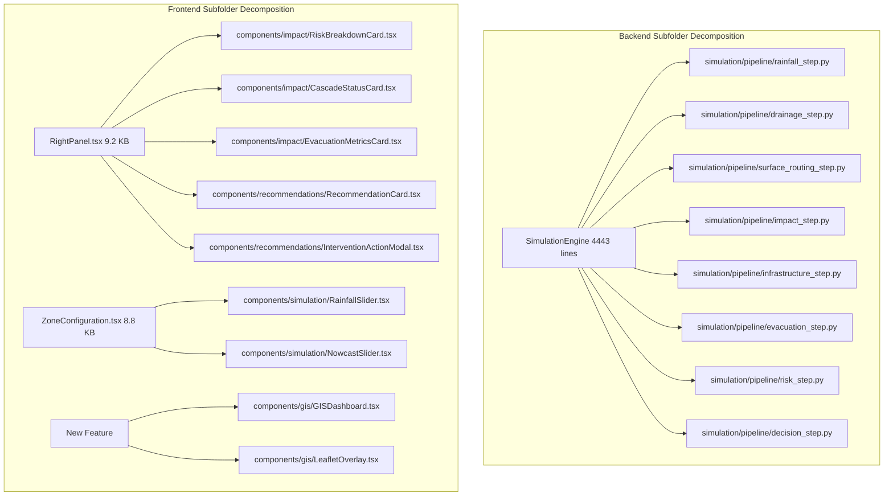

# SATARK — Codebase Audit & System Readiness Report
## Urban Flood Nowcasting System (Drainage and Rainfall Coupling)

> **Date**: 2026-09-13  
> **Auditor**: SATARK Digital-Twin Engineering Team  
> **Scope**: Full source code review of `backend/`, `frontend/`, and root against the competition problem statement  
> **Strategic Alignment**: 100% focus on **Urban Flood Nowcasting System (Drainage and Rainfall Coupling)**. The legacy Earthquake calamity is deprecated and being completely eliminated. Monolithic files are being decomposed into purpose-built subfolders.

---

## 1. Executive Summary

SATARK is a zone-based disaster-response digital twin built as a **Django + DRF** backend with a **React + Three.js** command center frontend. The project has a **substantial simulation backbone** already in place — covering flood propagation, ML-based impact prediction, infrastructure cascade analysis, population panic modeling, evacuation routing (Dijkstra), crowd dynamics, risk assessment, decision recommendations, and intervention optimization. The frontend features a **3D holographic city visualization** with zone overlays, cohort agent rendering, and a command-center UI.

### Key Strategic & Architectural Decisions
1. **100% Alignment with Competition Statement (Drop Earthquake)**:
   The system was originally scaffolded for two calamities (Flood and Earthquake). However, the competition strictly mandates an **Urban Flood Nowcasting System (Drainage and Rainfall Coupling)**. Earthquake in the codebase was only partially scaffolded (stepping was a `pass` statement in `engine.py:2176`, visuals were just a canvas vibration). **Earthquake is being completely removed** from all backend and frontend layers to eliminate dead code and focus entirely on coupled drainage hydraulics and rainfall nowcasting.
2. **Forensic Audit of Empty Files (69 Frontend Stubs & Backend Dead Code)**:
   The audit investigated all empty / 2-byte files in `frontend/src/` and unused backend directories. **None of the 69 frontend stubs are needed.** Every single one was an early placeholder from a planned multi-page/micro-component design that was subsequently consolidated into monolithic active files (`CityRenderer.ts`, `CommandCenter.tsx`, `LeftPanel.tsx`, `RightPanel.tsx`, `ZoneConfiguration.tsx`, `simulationApi.ts`, `worldApi.ts`). An AST import scan proved that **zero imports** reference these 69 files. They are safe to delete immediately.
3. **Purpose-Built Subfolder Decomposition**:
   Keeping 4,443 lines in `engine.py`, 1,387 lines in `CityRenderer.ts`, and monolithic 300+ line React panels (`RightPanel.tsx`, `ZoneConfiguration.tsx`) creates high technical debt and prevents efficient feature addition. We are decomposing them into modular subfolders:
   - `backend/simulation/pipeline/`: Decomposing `SimulationEngine` into 8 discrete step handlers.
   - `backend/algorithms/drainage/`: For the graph network, Manning pipe hydraulics, and surcharge coupling.
   - `backend/algorithms/rainfall/`: For hyetographs and 0–3h nowcasts.
   - `backend/algorithms/navigation/`: For the flood-safe route navigation REST API.
   - `frontend/src/components/impact/` & `components/recommendations/`: Breaking up `RightPanel.tsx`.
   - `frontend/src/components/simulation/`: Breaking up `ZoneConfiguration.tsx`.
   - `frontend/src/components/gis/`: For the new 2D Leaflet GIS overlay.
4. **Core Competition Gaps to Build**:
   While SATARK's decision-support and visualization systems are advanced, the core physics mandated by the problem statement — **graph-based drainage networks (Manning hydraulics), surface-drainage coupling (surcharge/backflow), 0–3 hour rainfall nowcasting (hyetographs), street-level depth in centimeters, and an external flood-safe navigation route REST API** — must now be built.

---

## 2. Problem Statement Requirements vs. Current Status

| # | Requirement | Status | Current Codebase Status | Target Implementation |
|---|---|---|---|---|
| 1 | **Real-time rainfall nowcasts (Doppler Radar / Hyetographs)** | ❌ Missing | Static `rainfall_intensity` float parameter; no temporal or spatial variation. | Ingest time-series rainfall hyetographs (Chicago Design Storm, IMD radar curves) varying over 0–3 hours in `backend/algorithms/rainfall/hyetograph.py`. |
| 2 | **High-resolution Digital Elevation Model (DEM)** | ⚠️ Partial | Zone elevations are derived from GLB mesh Y-coordinates (`center_normalized.y`), not real DEM rasters. | Couple with real Mumbai SRTM 30m DEM elevation grid. |
| 3 | **2D surface terrain water routing** | ⚠️ Simplified | Discrete elevation-gradient flow across 21 zones. Suffers from non-conservative mass flow. | Mass-conserving 2D flow routing with D8 flow direction and strictly bounded outflows in `backend/algorithms/flood/propagation.py`. |
| 4 | **Graph-based stormwater drain network** | ❌ Missing | No drainage graph. Each zone has a flat `drainage_capacity = 0.05` constant. | Graph model (`DrainageNetwork`) in `backend/algorithms/drainage/network.py` with manholes/inlets as nodes, pipes/canals as edges with diameter, slope, roughness ($n$). |
| 5 | **Hydraulic capacity, surcharge & backflow** | ❌ Missing | No pipe capacity modeling; no surcharge detection. | Manning's formula pipe flow: $Q = \frac{1}{n} A R^{2/3} S^{1/2}$ in `backend/algorithms/drainage/hydraulics.py`. Surcharge pushes water back to surface streets when pipes overflow. |
| 6 | **Street-level water depth predictions (cm)** | ⚠️ Coarse | Water levels are per-zone (21 zones). Units are abstract floats (e.g. `0.25`). | Sub-zone grid cells and street segments reporting water depth in real **centimeters (cm)**. |
| 7 | **0–3 hour forward-looking nowcast window** | ❌ Missing | Simulation only steps forward real-time tick-by-tick with no lookahead projections. | Dedicated `NowcastEngine` in `backend/algorithms/rainfall/nowcast.py` forking simulation state to produce $t+1\text{h}, t+2\text{h}, t+3\text{h}$ flood depth projections. |
| 8 | **Dynamic web-based GIS dashboard** | ⚠️ Partial | 3D holographic city view exists, but lacks georeferenced GIS maps (Leaflet/Mapbox, lat/lon coordinates). | Add Leaflet 2D GIS overlay toggle with georeferenced flood contours in `frontend/src/components/gis/` alongside the 3D command center. |
| 9 | **API for flood-safe route navigation** | ❌ Missing | Evacuation Dijkstra runs internally for cohort agents, but no external REST endpoint exists. | Public REST API: `POST /api/navigation/route/` returning shortest flood-safe route avoiding water $> 30\text{ cm}$. |
| 10 | **Urban Flood Interventions** | ✅ Built | 4 interventions: mobile pumps, traffic rerouting, backup generators, mandatory evacuation with cost/benefit optimization. | Retain and enhance with pump deployment directly to drainage outfalls and surcharge nodes. |

---

## 3. Codebase Class & Component Mapping (Current Reality)

### Backend Current Class Architecture
- **Agents**: `HumanAgent` (`agents/agent.py`), `AgentManager` (`agents/manager.py`), `NormalBehavior`, `PanicBehavior`.
- **Algorithms**:
  - `CasualtiesEngine` (`algorithms/casualties/estimation.py`)
  - `FloodPropagator` (`algorithms/flood/propagation.py`), `FloodImpactEngine` (`algorithms/flood/impact.py`)
  - `ExplainableNetwork` (`algorithms/infrastructure/cascade.py`)
  - `InterventionRuleEngine` (`algorithms/intervention/recommendations.py`)
  - `PanicEngine`, `EvacuationEngine` (Dijkstra), `CrowdDynamicsEngine` (`algorithms/population/`)
- **Simulation**:
  - `SimulationClock` (`simulation/clock.py`), `Scenario` (`simulation/scenario.py`), `SimulationWorld` (`simulation/world.py`)
  - `SimulationPipeline` & 9 Steps (`simulation/pipeline/`): `RainfallStep`, `DrainageStep`, `SurfaceFloodStep`, `FloodImpactStep`, `InfrastructureCascadeStep`, `HumanEvacuationStep`, `RiskAssessmentStep`, `DecisionInterventionStep`, `MetricsStep`.
  - `SimulationEngine` (`simulation/engine.py`): 2,537-line orchestrator; executes ticks via `SimulationPipeline`, manages clock, state synchronization, and dynamic interventions.
- **Decision & Risk**: `RiskEngine` (`risk/risk_engine.py`), `OptimizationEngine` (`decision/optimizer.py`), `PriorityEngine` (`decision/priority.py`), `RecommendationEngine` (`decision/recommendation.py`).
- **Data & Infrastructure**: `Facility` (`infrastructure/facility.py` - active shelter model).

### Frontend Current Component Architecture
- **3D City**: `CityRenderer.ts` (1,387 lines, 52.9 KB), `CameraController.ts` (33.1 KB), `AgentRenderer.ts` (23.2 KB), `ZoneRenderer.ts` (13.7 KB), `FloodRenderer.ts` (4.4 KB).
- **HUD Workflow**: `LeftPanel.tsx` (6.5 KB), `RightPanel.tsx` (9.2 KB monolith), `ZoneConfiguration.tsx` (8.8 KB monolith), `CompactControls.tsx` (1.9 KB).
- **Layout & Telemetry**: `CommandCenterLayout.tsx`, `CommandHeader.tsx`, `TimelineBar.tsx`, `StatusBar.tsx`.
- **State**: Unified Zustand store in `src/store/index.ts` composing `simulationSlice`, `worldSlice`, `agentSlice`, `uiSlice`.

---

## 4. Subfolder Decomposition Plan

---

## 5. Execution Roadmap: Urban Flood Nowcasting Alignment

- **Phase 0: Complete Cleanup, Earthquake Elimination & Test Repair**
  - Delete 69 empty frontend stubs and backend dead code subsystems.
  - Delete all earthquake code and tests across backend and frontend.
  - Fix test suite with `pytest.ini` and `conftest.py` until 100% of tests pass.
- **Phase 1: Pure Flood Modular Pipeline Engine**
  - Decompose `engine.py` into `backend/simulation/pipeline/` step handlers.
  - Cache zone mappings in memory; replace raw `print()` statements with standard logging.
- **Phase 2: Graph-Based Drainage Network & Manning Hydraulics**
  - Model stormwater drainage network (`backend/algorithms/drainage/`).
  - Implement Manning's equation for pipe flow capacity, surcharge detection, and surface backflow.
- **Phase 3: Surface Water Routing & Mass Conservation**
  - Rewrite flood propagation with strictly mass-conserving directed flows.
  - Couple 2D surface routing with drainage inlets; report depth in real centimeters (cm).
- **Phase 4: Temporal Rainfall Hyetographs & 0–3 Hour Nowcasting**
  - Ingest dynamic hyetographs (`backend/algorithms/rainfall/`).
  - Build `NowcastEngine` producing $t+1\text{h}, t+2\text{h}, t+3\text{h}$ forward depth forecasts.
- **Phase 5: World REST Endpoints & Flood-Safe Route Navigation API**
  - Implement `GET /api/world/zones/`, `shelters/`, `bounds/`.
  - Expose `POST /api/navigation/route/` for external navigation systems (`backend/algorithms/navigation/`).
- **Phase 6: ML Model Optimization & Vectorized Inference**
  - Train a fast, lightweight `< 5 MB` LightGBM regressor; implement singleton cache and pure NumPy pipeline.
- **Phase 7: Dynamic GIS Dashboard & Modular UI Components**
  - Decompose `RightPanel.tsx` and `ZoneConfiguration.tsx`.
  - Add Leaflet 2D GIS overlay toggle with georeferenced contours and nowcast forecast slider in `components/gis/`.
- **Phase 8: Real Metro Geospatial Data Integration**
  - Ingest Mumbai SRTM 30m DEM elevation data and Mumbai 26 July 2005 historical storm profile.
- **Phase 9: Comprehensive Benchmarking, Docs & Presentation**
  - Full automated test coverage, performance benchmarks, and judge methodology documentation.
